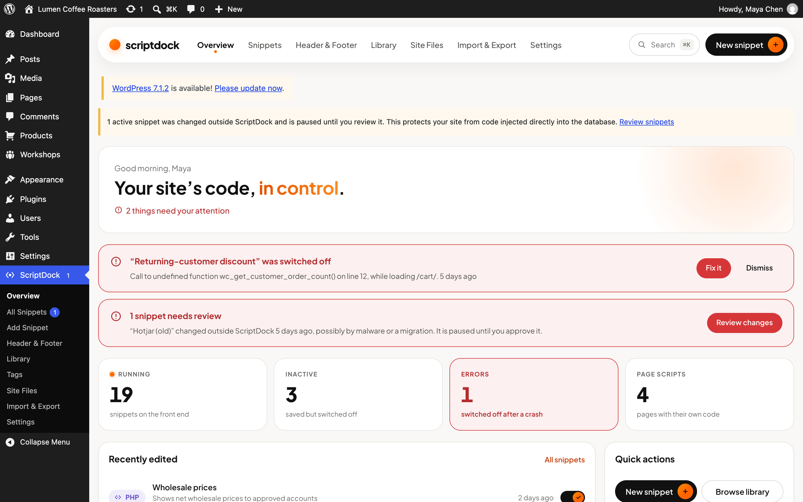
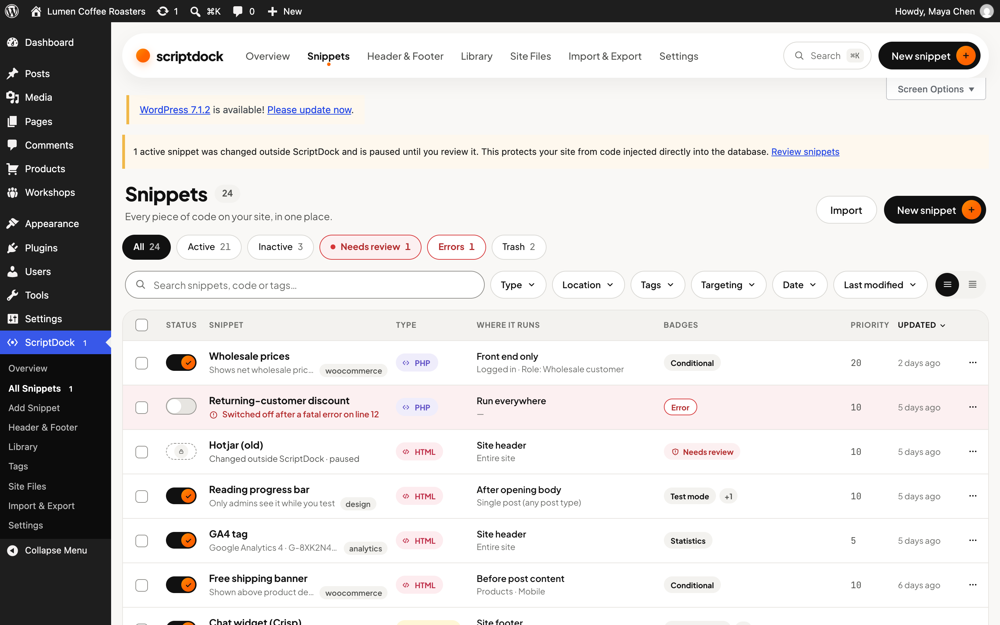
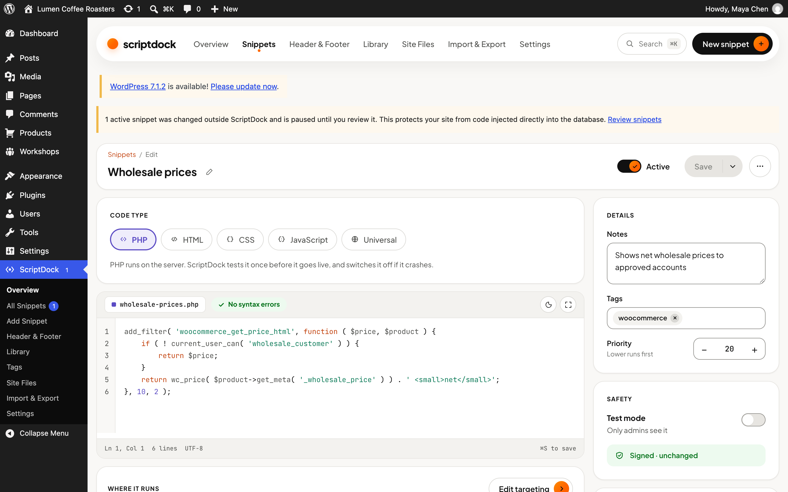
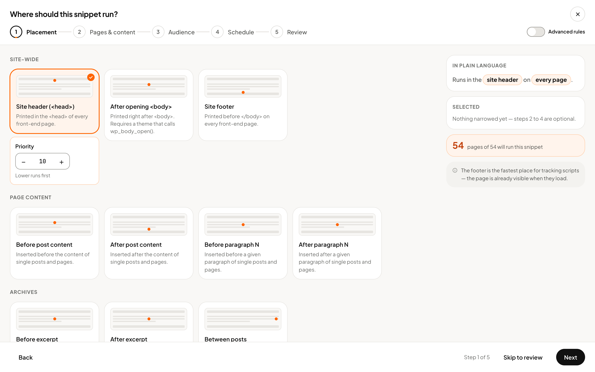
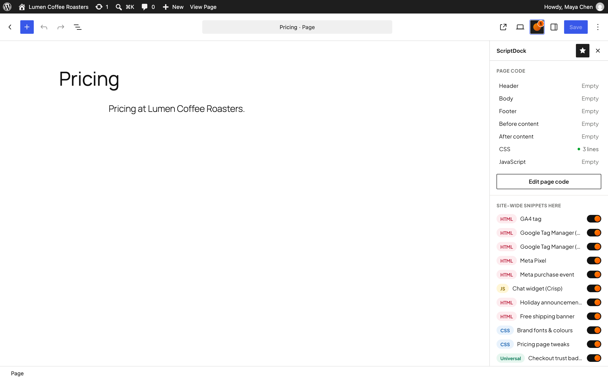
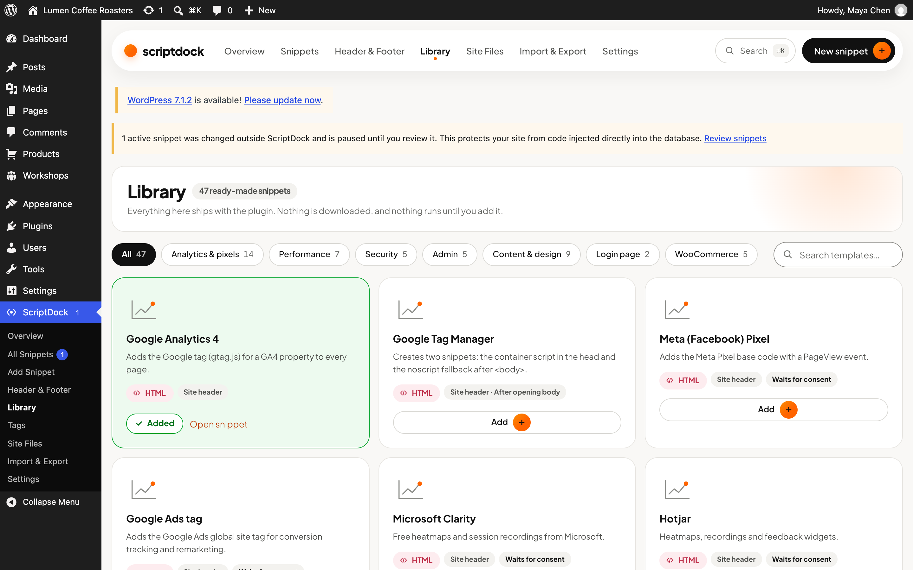
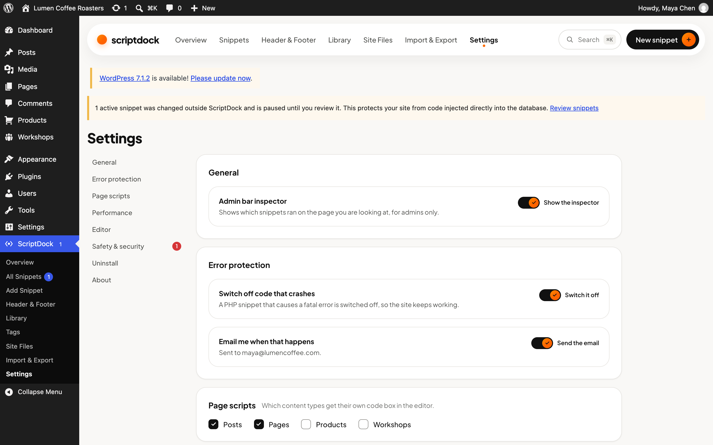

# ScriptDock

A free, full-featured code manager for WordPress: add PHP, HTML, CSS and JavaScript site-wide, per page or by rules, with crash protection, tamper protection, revisions and no paywalls.

## Screenshots



<table>
<tr>
<td width="50%"><br><b>Snippets</b> — filters, bulk actions, switches</td>
<td width="50%"><br><b>Editor</b> — live syntax checks, smart tags, history</td>
</tr>
<tr>
<td><br><b>Targeting</b> — five steps, written in plain language</td>
<td><br><b>Page code</b> — in the block editor sidebar</td>
</tr>
<tr>
<td><br><b>Library</b> — 47 ready-made snippets</td>
<td><br><b>Settings</b> — safe mode, tamper protection, PHP rights</td>
</tr>
</table>

## Why this is self-hosted

Since 1 September 2026 the WordPress.org developer FAQ states that the directory does "not accept new plugins that allow arbitrary code insertion or execution", naming PHP and JavaScript editors. Existing plugins like WPCode and Code Snippets were approved years earlier. ScriptDock is therefore distributed from GitHub (or your own site) and updates itself from GitHub releases. It still follows WordPress coding and security standards; Plugin Check passes apart from the expected "plugin updater detected" notice.

## Features

| Area | What you get |
|---|---|
| Code types | PHP, HTML, CSS, JavaScript, Universal (HTML with `<?php ?>`) |
| Locations | Head, after `<body>`, footer, before/after content, before/after paragraph N, between posts, excerpts, admin head/footer, login page, block editor, 12 WooCommerce hooks, any custom action, shortcode/block only; PHP everywhere / front end / admin / on demand |
| Per page | Sidebar panel and full-screen code window in the block editor, meta box in the classic editor: head, body, footer, before/after content, CSS, JS, and switches to disable site-wide snippets on that page. Saved with the post |
| Conditions | AND/OR rule groups, show/hide: page type, post type, specific posts, child of, terms, template, author, post meta, URL (wildcard/regex), URL params, referrer, cookies, login status, role, user meta, device, browser, OS, weekday, time window, date, language (Polylang/WPML), custom PHP function, Woo cart total/contents |
| Safety | Live PHP syntax check, test run before activation, automatic deactivation on fatal errors (identified per snippet, even inside hooks), email alerts, safe mode (secret URL, admin bar, constant), revisions with restore, test mode, scheduling |
| Security | HMAC tamper protection for snippets, page code, global code and the runtime cache; PHP requires `edit_plugins` (honours `DISALLOW_FILE_EDIT`); `SCRIPTDOCK_DISABLE_PHP` kill switch |
| Performance | One signed autoloaded option at runtime, CSS/JS as cached files, CSS minifier, defer/async/idle/on-interaction loading, WP Consent API gating |
| The admin | Overview dashboard, five-step targeting wizard with a plain-language summary, side-by-side history, command palette (Cmd/Ctrl K), guided first-run setup, light/dark code editor |
| Extras | 47-template library, smart tags incl. WooCommerce order data, Header & Footer screen, ads.txt/app-ads.txt/llms.txt/security.txt/robots.txt editor, admin bar inspector, JSON import/export, migration from WPCode, Code Snippets, HFCM and Simple Custom CSS & JS, WP-CLI, Site Health |

## Repository layout

```
scriptdock/                 The plugin (this folder is what ships)
  scriptdock.php            Bootstrap, constants, autoloader
  uninstall.php             Opt-in data removal
  readme.txt                WordPress readme
  includes/                 Core classes (namespace ScriptDock\)
    class-runtime.php         Attaches compiled snippets to hooks, renders output
    class-compiler.php        Builds the signed runtime cache
    class-stream.php          In-memory stream wrapper that runs PHP snippets
    class-error-handler.php   Fatal error detection and auto-deactivation
    class-crash-email.php     The HTML email sent when a snippet is switched off
    class-signer.php          Tamper protection (HMAC)
    class-conditions.php      Rule engine
    class-page-scripts.php    Per-page code, and the meta the block editor saves
    admin/                    Admin screens (namespace ScriptDock\Admin\)
    rest/                     scriptdock/v1 controllers; every screen talks to these
  src/                      React sources for the admin, one folder per screen
  build/                    Compiled bundles (npm run build) — these are what load
  assets/
    css/app/                  The design system: tokens, base, components, screens
    css/block/                The Snippet block, self-contained for the editor canvas
    css/admin-bar.css         The front-end inspector
    js/loader.js              Front-end delayed-script loader
    fonts/, icons/            Bundled fonts and the icon set (shared with PHP)
  blocks/snippet/           "ScriptDock Snippet" block (built from src/block-editor/)
  library/                  Snippet templates (templates.php + code/)
bin/rename.py               Rebrand everything in one command
bin/build.sh                Build dist/<slug>.zip
dev/                        Docker WordPress for development, and dev/demo for the
                            sample site the screenshots come from
tests/                      Integration test scripts
docs/RESEARCH.md            Competitor research and roadmap
docs/screenshots/           Release screenshots (not shipped in the plugin)
docs/release-notes/         Release bodies, ready to paste into GitHub
design-brief/               The brief the admin was designed from
design_handoff_scriptdock/  The design handoff: README and .dc.html references
```

## How it works

- **Storage.** Snippets are a private post type (`scriptdock_snippet`): code in `post_content`, settings in post meta, tags in a taxonomy. That gives revisions, trash and the core list table for free.
- **Runtime.** On save, active snippets are compiled into one JSON payload stored in the `scriptdock_runtime` option together with an HMAC. Each request reads that single option, verifies it and attaches snippets to their hooks. No post queries on the front end.
- **Running PHP.** PHP snippets are `include`d through an in-memory stream wrapper (`scriptdock://snippet/{id}`). Nothing is written to disk and `eval()` is not used; errors and stack traces name the exact snippet, so the shutdown handler can switch off the right one even when the error happens later inside a hook the snippet registered.
- **Tamper protection.** Every snippet is signed with a key derived from `wp-config.php` secrets (or `SCRIPTDOCK_SIGNING_KEY`). Code changed directly in the database no longer matches and is not run until an administrator reviews and saves it.

## Development

Requirements: Docker for WordPress, and Node for the admin bundles (`npm install`). The admin screens are React, compiled by `@wordpress/scripts` into `scriptdock/build/`; `npm start` rebuilds as you edit.

```bash
cd dev
docker compose up -d
docker compose run --rm cli core install --url=http://localhost:8089 --title="ScriptDock Dev" --admin_user=admin --admin_password=admin --admin_email=admin@example.com --skip-email
docker compose run --rm cli plugin activate scriptdock
```

The site runs on http://localhost:8089 and is bound to 127.0.0.1 only. The dev-only mu-plugin `dev/mu-plugins/dev-autologin.php` logs you in as the admin when a URL has `?dev-login=1`, or as anyone else with `?dev-login=<user_login>` — useful for checking what someone without ScriptDock rights sees. `?dev-rtl=1` switches the admin to right-to-left. Never copy these to a real site.

Both sites define `SCRIPT_DEBUG`, and they need to. Without it the plugin's
stylesheets are served as `?ver=<plugin version>`, which does not change while
you work — the browser then keeps the CSS it cached days ago while the
JavaScript bundles (hashed by webpack) update on every build. New markup with
old styles looks like a screenful of bugs. If a screen ever looks wrong for you
but right in a fresh browser profile, check this first.

`dev/demo/` is a second site on port 8090 with realistic sample data (a coffee roaster with 24 snippets, a crash and a tampered snippet). It is what the screenshots above come from: `cd dev/demo && docker compose up -d`, then seed it with `docker compose run --rm cli eval-file /demo/seed.php --user=maya`.

### Tests

```bash
# PHP syntax on 8.3 and the minimum supported 7.4
for v in wordpress:php8.3-apache php:7.4-cli; do docker run --rm -v "$PWD/scriptdock:/p" $v sh -c 'find /p -name "*.php" -print0 | xargs -0 -n1 php -l | grep -v "^No syntax"'; done

# The REST layer, run inside WordPress
cd dev && docker compose run --rm cli eval-file /tests/rest.php --user=admin && cd ..

# HTTP-level checks. Each one seeds and cleans up after itself.
tests/check-admin-pages.sh   # every admin screen loads; the no-access page
tests/check-rest.sh          # auth, fatal errors, syntax errors, boot skipping
tests/check-frontend.sh      # output, schedules, test mode, page code, virtual files

# Lint and build
npm run lint:js && npm run lint:css && npm run build

# WordPress Plugin Check (security and coding standards).
# "plugin_updater_detected" is expected and is the only thing that should appear.
cd dev && docker compose run --rm cli plugin install plugin-check --activate
docker compose run --rm cli plugin check scriptdock
```

`tests/migrate-fixtures.php` creates sample data in WPCode, Code Snippets, HFCM and Simple Custom CSS & JS (install and activate them first) to test the importers.

## Releasing

1. Bump `Version` in `scriptdock/scriptdock.php`, `SCRIPTDOCK_VERSION`, and `Stable tag` in `readme.txt`; add a changelog entry.
2. Write the release body in `docs/release-notes/<version>.md`.
3. `bin/build.sh` creates `dist/scriptdock.zip`.
4. Create a GitHub release tagged `v1.2.3`, paste the release body, and attach `scriptdock.zip`.

Sites running the plugin see the update in Dashboard > Updates. They check the repository in `SCRIPTDOCK_UPDATE_REPO` (`onlee-agency/scriptdock`, set in the main plugin file next to the `Update URI` header; `wp-config.php` can override it, or set it to `''` to switch checks off). The repository must be public, because sites ask GitHub without a token. `bin/rename.py --repo owner/repo` changes both.

The "View details" panel in WordPress shows the GitHub release notes, not `readme.txt`, so write the release notes for the people who will read them there.

## Renaming

```bash
python3 bin/rename.py --name "Snippet Pilot" --slug snippet-pilot --repo your-org/snippet-pilot --dry-run
python3 bin/rename.py --name "Snippet Pilot" --slug snippet-pilot --repo your-org/snippet-pilot
```

It rewrites the display name, slug/text domain, PHP namespace, prefixes, constants, JavaScript globals, CSS classes, block name and file names, and shortens the post type name to fit WordPress's 20-character limit. Rename **before** the first public release: option names, meta keys and the post type change with the prefix.

## Configuration constants (`wp-config.php`)

| Constant | Effect |
|---|---|
| `SCRIPTDOCK_SAFE_MODE` | Stop all snippets site-wide |
| `SCRIPTDOCK_DISABLE_PHP` | Never run or edit PHP snippets |
| `SCRIPTDOCK_ALLOW_PHP_WITHOUT_FILE_EDIT` | Allow PHP snippets even when `DISALLOW_FILE_EDIT` is set |
| `SCRIPTDOCK_SIGNING_KEY` | Dedicated tamper-protection key (survives salt rotation) |
| `SCRIPTDOCK_DISABLE_TAMPER_PROTECTION` | Turn tamper protection off |
| `SCRIPTDOCK_UPDATE_REPO` | GitHub `owner/repo` for updates |

## Developer hooks

- `scriptdock_required_capabilities` (filter): capabilities needed to manage snippets.
- `scriptdock_condition_rules` (filter) + `scriptdock_evaluate_condition` (filter): add custom condition rules.
- `scriptdock_smart_tag_value` (filter): add custom smart tags.
- `scriptdock_library_templates` (filter): add library templates.
- `scriptdock_content_priority` (filter): priority of content insertion.
- `scriptdock_rebuilt` (action): fired after the runtime cache is rebuilt.

## License

GPL-2.0-or-later.
